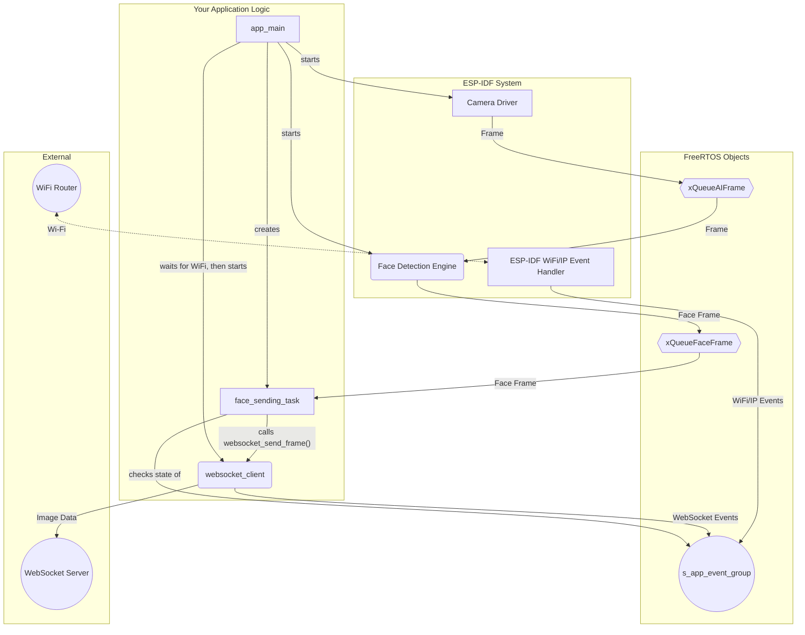

# ESP32-CAM Face Detection WebSocket Client

**IMPORTANT NOTE:** make sure that the `/componets/esp-dl` directory is from `esp-who v1.1.0`, this is the one containing the correct face recognition libraries. NEWER LIBRARIES DONT. Several files in the components libraries have been heavily adapted (e.g., `../components/modules/ai/who_human_face_detection.cpp'). All alterations have comments starting with "// George".

This project captures video from an ESP32 camera, perorming real-time face detection over the video stream, and if a face is detected (NOT identified due to limited capabilites), sends the particular frames (those with faces) to a websocket server. It implemepts concurennt tasks (FreeRTOS capability from ESP-IDF libraries) over an event-driven architecture to identify network state (e.g., wifi status).

## Project Architecture

The system is designed with modularity in mind, each component has a specific task. They communicate using thread-safe FreeRTOS primitives like Queues and Event Groups.

## Core Components

- `app_main.cpp` (Orchestrator): Initializes and manages all other components. It handles the main application and state transitions.
- `websocket_client.cpp` (Network Communicator): Implements connection logic, sending data, and actively mantain the WebSocket connection. IMPORTANT: It has to be cpp, because of communication with  /*.hpp files from esp libraries.*
- `wifi.c` (Connectivity Layer): Will handle the Wi-Fi connection and reconnection.
- Face Detection: ESP-IDF provided external library (`who_human_face_detection`). It will processes image frames to find faces (detect). IMPORTANT: make sure that the /componets/esp-dl directory is from esp-who v1.1.0, this is the one containing the correct face detection libraries, if used in ESP32-CAM (up-to-date versions do not work)
- Camera Driver: ESP-IDF external library (`who_camera`) that configures the camera and captures image frames. **IMPORTANT:** Remember to set the particular project and camera settings via `idf.py menuconfig`. Make sure you set the correct memory size and custom partitions (provided in the project `partitions.csv'), otherwise you will get "bin does not fit into memory" errors.

## Architectural Diagram

This diagram shows the flow of data and control signals between the components.

________________________________________

________________________________________

## Component Breakdown

`app_main.cpp` - The Orchestrator. This file contains the primary application logic.
•	-`app_main()`: The main point right after boot. It initializes hardware, starts the WiFi, creates the` s_app_event_group` for state management, and starts all applications. It starts/restarts the WebSocket client when the WiFi connection is established/down.
•	- `app_event_handler():` A callback function that listens for system-wide events (IP_EVENT_STA_GOT_IP and WIFI_EVENT_STA_DISCONNECTED). It updates the application's state On/Off (1/0) bits in the `s_app_event_group`.
•	`face_sending_task()`: A FreeRTOS task for sending frames. It waits for frames with faces to appear in the `xQueueFaceFrame` queue. Before sending, it blocks and waits for the `s_app_event_group` to acknowledge that both WiFi and WebSocket connections are ok.

`websocket_client.cpp` - The Network Communicator. It handles all WebSocket communication with thread-safe capabilities.
•	`websocket_client_start()`- : Init & start the WebSocket client connection. It registers its internal event handler to manage the connection status.
•	websocket_client_stop(): Stops and destroys the WebSocket client, release all resources.
•	`websocket_send_frame()`- : Sending data. It receives a camera frame buffer and transmits as binary data to the websocker server. It uses a mutex, so it can be called safely from different tasks.
•	`websocket_event_handler():`-  Callback function (private) waiting for WebSocket events (CONNECTED, DISCONNECTED, ERROR). It updates the connection status and sends signals to the main application via the `s_app_event_group`.
________________________________________
### Execution & Data Flow

1.	**Initialization**: `app_main` starts, initializes all services, and starts the WiFi connection. It creates the camera and face detection tasks in a loop.
2. WiFi Connection:** The app_event_handler waits for a system event to informa that it has an IP address. After this, it sets the `WIFI_CONNECTED_BIT` in `s_app_event_group`.
3. **WebSocket Connection**: If it is up, the main loop in app_main starts and calls `websocket_client_start()`. The client tries to connect, and on success, its event handler sets the `WEBSOCKET_CONNECTED_BIT`.
4. **Frame Pipeline**:
- The camera task continuously captures frames and sends them into xQueueAIFrame.
- The face detection task gets frames from xQueueAIFrame. If a face si found, it sends the frame into xQueueFaceFrame.
5. **Sending Logic:**
- The face_sending_task pops a frame from xQueueFaceFrame.
- It then waits the `s_app_event_group` for  WiFi and WebSocket bits to be set. So, it cannot try to send data before wifi and websocket are both ok, up and running. 
- After the connection is ok, it calls `websocket_send_frame()` and sends the (raw) image.
6. **isconnection Handling**: 
If the WiFi connection drops, the `app_event_handler` clears the relevant bits in the event group and stops the WebSocket client. The `face_sending_task` then waits ns because its `xEventGroupWaitBits` call will fail. The main loop in `app_main` will wait for WiFi to reconnect and only then restart the process. TODO: What happens if the WIFI is not available? does it drain the battery trying? 
________________________________________
**How to Build**
To build the project, run the following commands within the project's root directory:

```
Bash
# Clean any previous build artifacts (recommended)
idf.py fullclean

# Build the project
idf.py build

# Flash to the device and open a serial monitor
idf.py flash monitor

# or if you wish, all together (Highly recommended, saves time and errors!) XX=port num in Windows.
idf.py -p COMXX fullclean build flash monitor
```
