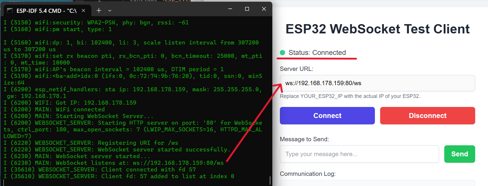
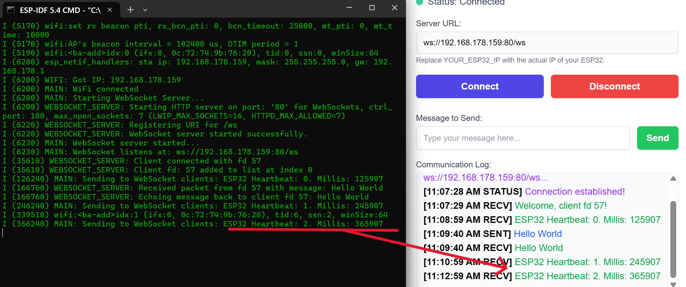
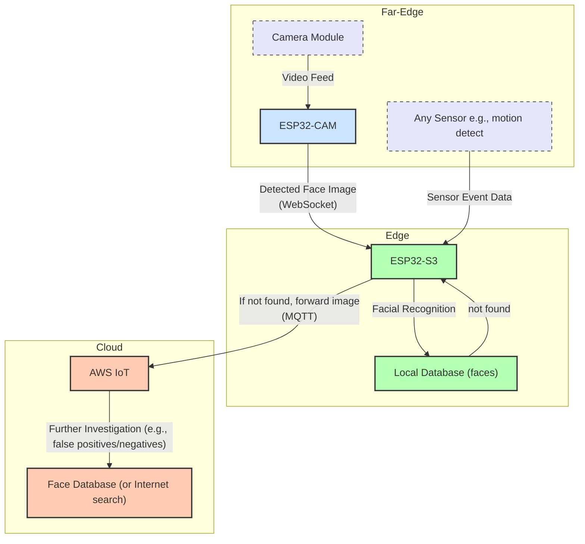

# ESP32 WebSocket && MQTT Application

ESP32 application with WiFi, WebSocket server, and MQTT client for AWS IoT. It is provides modularity, so you can enable/disable functionalities.






## Project Architecture and Purpose

This project is a classic three-tier IoT architecture, from the far-edge to the edge, and eventually to the cloud. The system is designed for decentralized processing by distributing workloads across devices with different capability levels. 

As the far-edge implementation, an ESP32-CAM camera module is responsible for initial face detection only, due to limited capabilities (i.e., detect a face in a particular frame in the video feed. NOTE: Only detect face, not identify). If a face is detected, the particular image only is transmitted over a WebSocket connection to the more powerful ESP32-S3 module, implementing the edge aspect. The WebSocket server running on it ensures a persistent, low-latency, robust communication with the far-edge devices (e.g., camera, sensors, etc.) for real-time applications.

The ESP32-S3 edge device performs facial recognition (identification) by comparing the received image against a local database of known faces. This intermediate step helps for rapid identification without cloud communication, reducing response time for standard, known faces (e.g., the database holds faces of all personnel). 

If the face is not recognized in the local database, the ESP32-S3 transfers the task to the cloud tier via MQTT to send the image to AWS IoT for more intensive investigation, such as comparison against an extensive database or further analysis (e.g., false positives/negatives of sensors). 

This 3-tier approach shows an applicable far-edge-to-cloud pipeline, optimized for speed and resource efficiency by assigning tasks at the appropriate level.

## Custom Data Transfer Protocol

The data transfer protocol between the websocket client (ESP32-CAM) and websocket server (ESP32-S3) is as follows:

On-Device Cropping: When the ESP32-CAM detects a face, crops the image to the specific bounding box of the detected face, so it reduces the size of the frame transmitted (Rough calculations: Full frame, uncomprossed QVGA ~150KBytes. Cropped face image ~40-60KB).

Application-Level Fragmentation: The cropped image is sent to the server in a series of chunks (~8KB each). The transfer is managed by a custom protocol using JSON control messages ({"type":"frame_start", ...}, {"type":"frame_end"}) that bracket the binary data. This is independent from the WebSocket library. Test it extensively!

Unique ID: Each face image is assigned an incrementing ID included in the messages and logged by the client and the server. TODO: Create an advanced complex ID, based on for example the MAC ADDRESS.

## Architecture



## Features

* **WiFi Connectivity**: Connection to a local WiFi.
* **WebSocket Server**: Tested communication with client application (websocket_cl;ient.html). Pictures below.
* **MQTT Client**: Communication with an MQTT broker, pre-configured for AWS IoT.
* **Modular**: In `config.h` you can enabling/disabling modules and `certificates/secrets.h` (file has to be created, example below) for credentials (WIFI ssid/password, etc.).

## Prerequisites

* Espressif IoT Development Framework (ESP-IDF) v5.x installed and configured.
* ESP32 development board (terminal outputs).
* (If using MQTT) AWS IoT account and configured devices & server keys.

## Setup and Installation

1.  **Clone the Repository**:
    ```bash
    git clone https://github.com/georgevio/IoT-Embedded.git
    cd IoT-Embedded/esp-idf/3-Level-Cloud
    ```
   Without Git commands, open this GitHub link:
   
   https://github.com/georgevio/IoT-Embedded/tree/main/esp-idf/3-Level-Cloud
   Click Download ZIP from the repository main page.
   Extract it and work with your files locally.

2.  **ESP-IDF Environment**:
    Ensure ESP-IDF environment is sourced/activated/installed. USE ONLY terminals provided within.
    ```bash
    # Example for Linux/macOS
    . $IDF_PATH/export.sh
    # Example for Windows
    %IDF_PATH%\export.bat
    ```

3.  **Create `secrets.h`**:
    Create a `certificates/secrets.h` file for your WiFi and (if applicable) MQTT credentials.
    Example `certificates/secrets.h`:
    ```c
    #ifndef SECRETS_H
    #define SECRETS_H

    // WiFi Credentials
    #define WIFI_SSID "YOUR_WIFI_SSID"
    #define WIFI_PASSWORD "YOUR_WIFI_PASSWORD"

    // AWS IoT Configuration (if MQTT_ENABLED is 1)
    #define AWS_IOT_ENDPOINT "YOUR_AWS_IOT_ENDPOINT"
    #define AWS_IOT_CLIENT_ID "YOUR_ESP32_CLIENT_ID"
    #define MQTT_TOPIC_BASE "esp32/device" // Example
    #define MQTT_TOPIC_STATUS MQTT_TOPIC_BASE "/status"
    #define MQTT_TOPIC_DEVICE MQTT_TOPIC_BASE "/data"

    #endif // SECRETS_H
    ```

4.  **Certificates for MQTT (if enabled)**:
    If `MQTT_ENABLED` is set to `1` in `config.h`, place your device certificate, private key, and the Amazon Root CA1 in the `certificates/` directory.
    * `AmazonRootCA1.pem`
    * `new_certificate.pem` (device certificate)
    * `new_private.key` (device private key)
    
	IMPORTANT NOTE: The `CMakeLists.txt` in the `main` component is configured to embed these files WITH THOSE EXACT NAMES. Be very careful with name changes...

5.  **Project Configuration (`main/config.h`)**:
    Modify `main/config.h` to enable/disable modules and set parameters:
    ```c
    #define MQTT_ENABLED 0      
    #define WEBSOCKET_ENABLED 1  
    #define WEBSOCKET_PORT 80
    // ... other configurations
    ```

6.  **ESP-IDF Configuration for WebSockets**:
    **IMPORTANT**: You must enable WebSocket support in the ESP-IDF project configuration:
    Run `idf.py menuconfig`.
    Go to: `Component config` ---> `HTTP Server` --->
    Enable `[*] Websocket server support`.
    Save and exit.

7.  **Build, Flash, and Monitor**:
    ```bash
    idf.py build
    idf.py -p /dev/YOUR_ESP32_PORT flash monitor
    ```
    Replace `/dev/YOUR_ESP32_PORT` with your ESP32's serial port (e.g., `COM3` on Windows, `/dev/ttyUSB0` on Linux).
	If you dont want to waste your time with typing, 
    ```	
		idf.py -p COMXX fullclean build flash monitor
    ```
	Obviously, it will stop if it fails building...
	
## Functional Overview

* **`main.c`**: NVS, WiFi, MQTT client and WebSocket server based on `config.h`. Includes a main loop with a heartbeat if none other.
* **`wifi.c` / `wifi.h`**: WiFi station mode.
* **`websocket_server.c` / `websocket_server.h`**: am HTTP server with WebSocket support on the `/ws` endpoint. Handles client connections and message exchanges.
* **`mqtt.c` / `mqtt.h`**: MQTT connection to AWS IoT, with publishing and event handling.
* **`config.h`**: Settings and module ON/OFF. Check carefully.
* **`certificates/`**: Directory for `secrets.h` and TLS certificates (AWS).

## Connecting to the WebSocket Server

When the application starts and connects to WiFi, the WebSocket server URI will be printed to the serial monitor:
`ws://<ESP32_IP_ADDRESS>:<WEBSOCKET_PORT>/ws`
Use the provided WebSocket client to connect to the URI and test.
