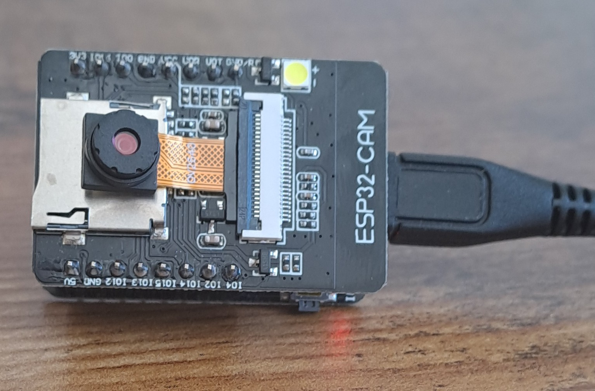
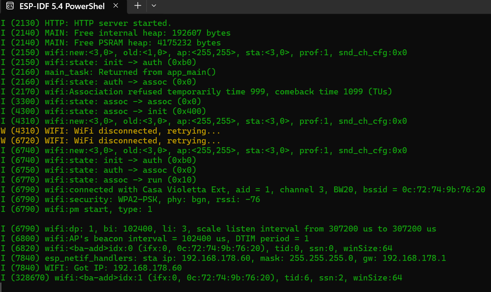

# ESP32-CAM Web Server with Live Streaming and Static Image Capture

This project implements a minimal web server on an **ESP32-CAM** module that provides live streaming as well as a static image capture feature. The application is using the ESP-IDF framework and provides a simple HTML interface to view the camera feed.






Click to watch a small video (youtube)

[](https://youtu.be/kzLEHtOoujQ)

---

## 🛠️ **Features**
- Live streaming of JPEG frames using multipart HTTP requests.
- Static image capture endpoint.
- Simple HTML interface to access the live feed.
- Configurable streaming and static image capture endpoints.
- Modular code structure for easy extension.

---

## 📦 **Directory Structure**

```
/esp32-cam-webPage/
├── CMakeLists.txt
├── main/
│   ├── camera.c        # Camera initialization and capture 
│   ├── camera.h
│   ├── http.c          # HTTP server implementation
│   ├── http.h
│   ├── main.c          # Main application entry point
│   ├── wifi.c          # WiFi connection management
│   └── wifi.h
├── sdkconfig           # ESP-IDF configuration file
├── partition_table.csv # Partition table configuration
├── README.md
└── Makefile
```

---

## 🚀 **Getting Started**

### **Prerequisites**

- [ESP-IDF v5.4.1](https://docs.espressif.com/projects/esp-idf/en/latest/esp32/get-started/index.html)  
- ESP32-CAM Module  
- USB to TTL Converter  
- WiFi Credentials  

---

### **1. Cloning the Repository**

```bash
git clone https://github.com/yourusername/esp32-cam-webPage.git
cd esp32-cam-webPage
```

---

### **2. Configuring the Project**

Copy the default configuration file:

```bash
cp sdkconfig.defaults sdkconfig
```

Edit the WiFi credentials in `wifi.c`:

```c
#define WIFI_SSID "your_ssid"
#define WIFI_PASS "your_password"
```

---

### **3. Building the Project**

Set up the ESP-IDF environment:

```bash
. $IDF_PATH/export.sh
```

Build and flash the project:

```bash
idf.py build
idf.py -p /dev/ttyUSB0 flash monitor
```

Replace `/dev/ttyUSB0` with your actual serial port.  

---

### **4. Accessing the Web Interface**

- Once the ESP32-CAM connects to the WiFi network, the IP address will be displayed in the serial output.  
- Open the IP address in a web browser to access the HTML interface.  
- The streaming endpoint is available at `/stream`.  
- The static image endpoint is available at `/capture`.

---

## 📝 **HTTP Endpoints**

| Endpoint       | Method | Description                       |
| -------------- | ------ | --------------------------------- |
| `/`            | GET    | Main HTML page with live feed     |
| `/stream`      | GET    | Live streaming of JPEG frames     |
| `/capture`     | GET    | Capture and serve a single frame  |

---

## 🔧 **Configuration Flags**

Configuration flags at the top of `http.c`:

```c
#define ENABLE_STREAMING 1   // Enable streaming endpoint
#define ENABLE_HTML_PAGE 1   // Enable HTML page
```

Configuration flags at the top of `main.c`:

```c
#define WI_FI_ON 1 // Enable WiFi to access the feed
#define WEB_SERVER_ON 1 // Debugging purposes
#define CONFIG_ESP_PSRAM_ENABLE 1 // Enable PSRAM, test accordingly
```

---

## 🛠️ **Implementation Details**

### **Camera Initialization**

- The camera is initialized in `camera.c` using the `camera_init()` function.
- The function sets up the I2C communication and configures the OV2640 sensor.

### **HTTP Server Implementation**

- The HTTP server is started in `http.c`.
- The streaming handler uses multipart responses to continuously send JPEG frames.

### **Error Handling**

- Error handling is implemented for both camera capture and HTTP response functions.
- If a frame capture fails, a 500 error is returned.

---

## 🔥 **Future Enhancements**

- Add image resolution configuration via the web interface.
- Implement image processing (e.g., grayscale, edge detection).
- Integrate SPIFFS for local storage of captured images.
- Add support for camera settings (brightness, contrast, etc.).

---

## ✅ **License**

This project is licensed under the MIT License. See the [LICENSE](LICENSE) file for more details.

