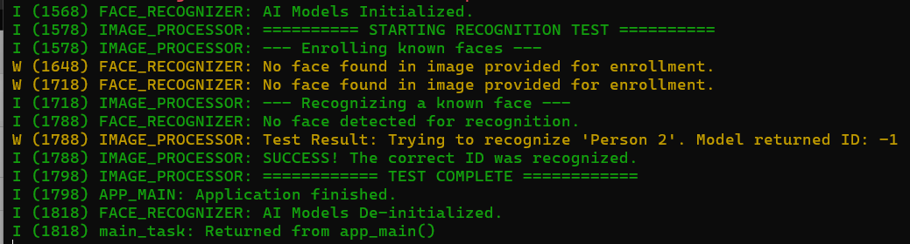

#IMPORTANT STEPS (Keep the order!)

If any step fails, it is better to do `idf.py fullclean', or simply delete all dirs named build, sdkconfig*, managed_components, and any other file you did not create, and start over (yes, it takes time, DAYS!)

**AFTER** your create the CMakeLists.txt files:

FIRST THING: 
`idf.py set-target esp32s3` # this MUST finish succesfully to continue. Otherwise, you need to carefully examine portings inside both CmakeLists.tx files.

Inside the project's directory, run these|:

```
idf.py add-dependency "espressif/human_face_detect"
idf.py add-dependency "espressif/human_face_recognition"
```

You should see this

```
NOTICE: Successfully added dependency "espressif/human_face_recognition": "*" to component "main"
```

Now, run `idf.py menuconfig` 

```
    models: human_face_detect  ---> (*) (Keep the defaults for now)
	models: human_face_feat  ---> (*) (Keep the defaults for now)
	Partition Table ---> (X) Large partition table (or similar)
	ESP PSRAM  ---> SPI RAM config  ---> Mode (QUAD/OCT) of SPI RAM chip in use (Quad Mode PSRAM) --> (X) Octal Mode PSRAM 
									--->    Set RAM clock speed (40Mhz clock speed)  ---> (X) 80MHz clock speed
```

The exact menu names in menuconfig might vary depending on the version, you have to search. And, yes, they are NOT in alphabetical order!

If you dont succeed in ANY of the above, do not proceed, your code will fail!

that is the minimal output

