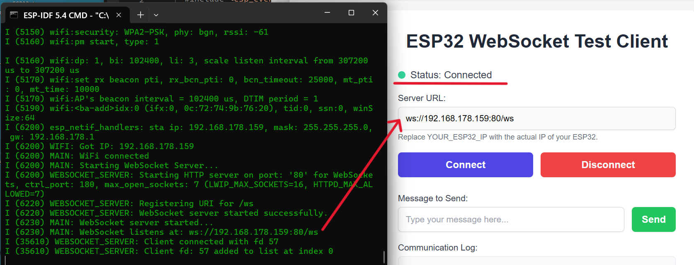

# ESP32 WebSocket and MQTT Application

ESP32 application with WiFi, WebSocket server, and MQTT client for AWS IoT. It is provides modularity, so you can enable/disable functionalities.




## Features

* **WiFi Connectivity**: Connection to a local WiFi.
* **WebSocket Server**: Tested communication with client application (websocket_cl;ient.html). Pictures below.
* **MQTT Client**: Communication with an MQTT broker, pre-configured for AWS IoT.
* **Modular**: In `config.h` you can enabling/disabling modules and `certificates/secrets.h` (user-created) for credentials (WIFI ssid/password, etc.).

## Prerequisites

* Espressif IoT Development Framework (ESP-IDF) v5.x installed and configured.
* ESP32 development board (terminal outputs).
* (If using MQTT) AWS IoT account and configured devices & server keys.

## Setup and Installation

1.  **Clone the Repository**:
    ```bash
    git clone <your-repository-url>
    cd <repository-name>
    ```

2.  **ESP-IDF Environment**:
    Ensure ESP-IDF environment is sourced/activated/installed. USE ONLY terminals provided within.
    ```bash
    # Example for Linux/macOS
    . $IDF_PATH/export.sh
    # Example for Windows
    %IDF_PATH%\export.bat
    ```

3.  **Create `secrets.h`**:
    Create a `certificates/secrets.h` file for your WiFi and (if applicable) MQTT credentials.
    Example `certificates/secrets.h`:
    ```c
    #ifndef SECRETS_H
    #define SECRETS_H

    // WiFi Credentials
    #define WIFI_SSID "YOUR_WIFI_SSID"
    #define WIFI_PASSWORD "YOUR_WIFI_PASSWORD"

    // AWS IoT Configuration (if MQTT_ENABLED is 1)
    #define AWS_IOT_ENDPOINT "YOUR_AWS_IOT_ENDPOINT"
    #define AWS_IOT_CLIENT_ID "YOUR_ESP32_CLIENT_ID"
    #define MQTT_TOPIC_BASE "esp32/device" // Example
    #define MQTT_TOPIC_STATUS MQTT_TOPIC_BASE "/status"
    #define MQTT_TOPIC_DEVICE MQTT_TOPIC_BASE "/data"

    #endif // SECRETS_H
    ```

4.  **Certificates for MQTT (if enabled)**:
    If `MQTT_ENABLED` is set to `1` in `config.h`, place your device certificate, private key, and the Amazon Root CA1 in the `certificates/` directory.
    * `AmazonRootCA1.pem`
    * `new_certificate.pem` (device certificate)
    * `new_private.key` (device private key)
    The `CMakeLists.txt` in the `main` component is configured to embed these files.

5.  **Project Configuration (`main/config.h`)**:
    Modify `main/config.h` to enable/disable modules and set parameters:
    ```c
    #define MQTT_ENABLED 0      
    #define WEBSOCKET_ENABLED 1  
    #define WEBSOCKET_PORT 80
    // ... other configurations
    ```

6.  **ESP-IDF Configuration for WebSockets**:
    **IMPORTANT**: You must enable WebSocket support in the ESP-IDF project configuration:
    Run `idf.py menuconfig`.
    Go to: `Component config` ---> `HTTP Server` --->
    Enable `[*] Websocket server support`.
    Save and exit.

7.  **Build, Flash, and Monitor**:
    ```bash
    idf.py build
    idf.py -p /dev/YOUR_ESP32_PORT flash monitor
    ```
    Replace `/dev/YOUR_ESP32_PORT` with your ESP32's serial port (e.g., `COM3` on Windows, `/dev/ttyUSB0` on Linux).
	If you dont want to waste your time with typing, 
    ```	
		idf.py -p COMXX fullclean build flash monitor
    ```
	Obviously, it will stop if it fails building...
	
## Functional Overview

* **`main.c`**: NVS, WiFi, MQTT client and WebSocket server based on `config.h`. Includes a main loop with a heartbeat if none other.
* **`wifi.c` / `wifi.h`**: WiFi station mode.
* **`websocket_server.c` / `websocket_server.h`**: am HTTP server with WebSocket support on the `/ws` endpoint. Handles client connections and message exchanges.
* **`mqtt.c` / `mqtt.h`**: MQTT connection to AWS IoT, with publishing and event handling.
* **`config.h`**: Settings and module ON/OFF. Check carefully.
* **`certificates/`**: Directory for `secrets.h` and TLS certificates (AWS).

## Connecting to the WebSocket Server

When the application starts and connects to WiFi, the WebSocket server URI will be printed to the serial monitor:
`ws://<ESP32_IP_ADDRESS>:<WEBSOCKET_PORT>/ws`
Use the provided WebSocket client to connect to the URI and test.
