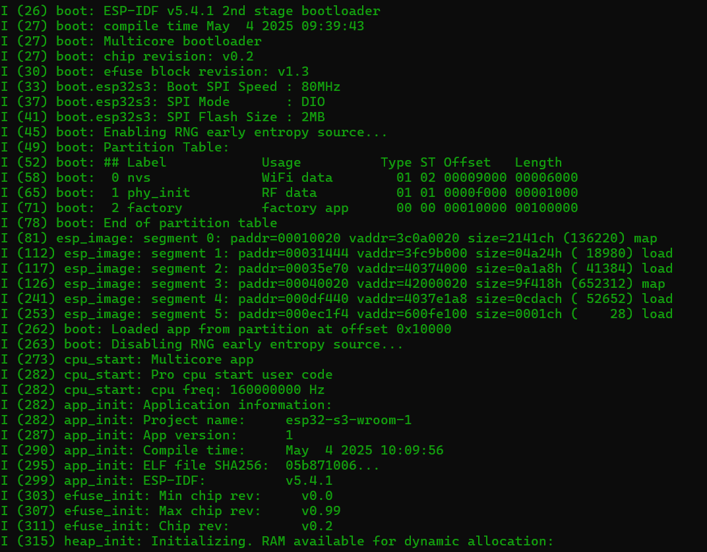
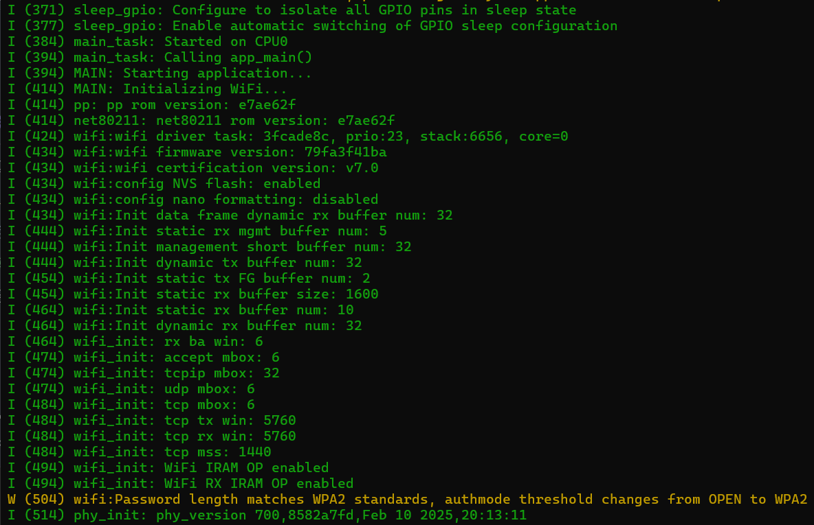
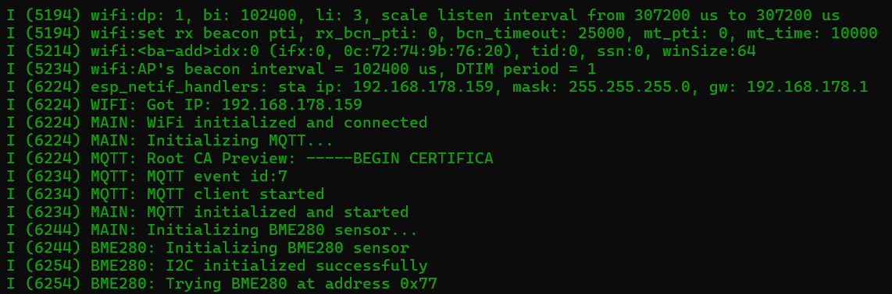
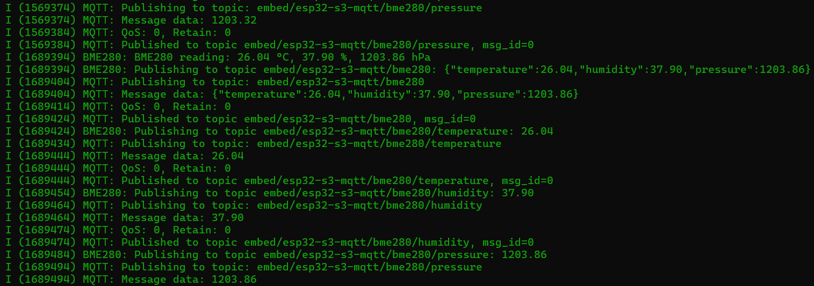
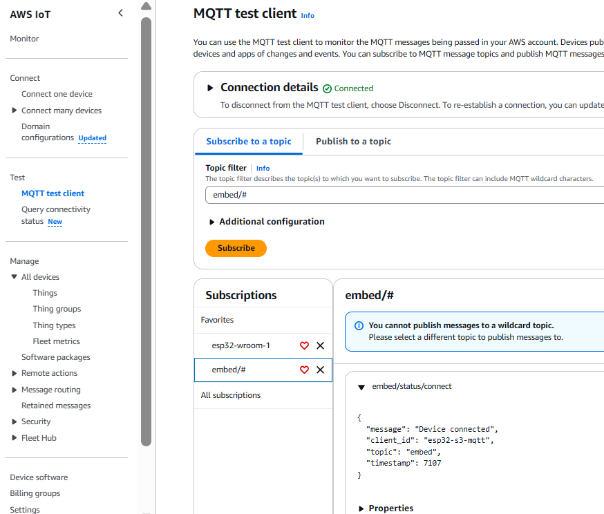

# ESP32-S3 Modular Firmware for AWS IoT

A modular firmware architecture for ESP32-S3-WROOM-1 devices with BME280 sensor integration and AWS IoT MQTT communication.

[](https://opensource.org/licenses/MIT)
[](https://github.com/georgevio/esp32-s3/releases/)
[](https://github.com/georgevio/esp32-s3)
[](https://github.com/espressif/esp-idf)
[](https://www.espressif.com/)
[](https://github.com/georgevio/esp32-s3/pulls)
[](https://github.com/georgevio/esp32-s3/stargazers)
[](https://aws.amazon.com/iot/)
[](https://www.bosch-sensortec.com/products/environmental-sensors/humidity-sensors-bme280/)
[](https://github.com/georgevio/esp32-s3#readme)
[](https://opensource.org/)

<div align="center">
  
  <p>
    <a href="https://github.com/georgevio/esp32-s3/stargazers">
      
    </a>
    <a href="https://github.com/georgevio/esp32-s3/network">
      
    </a>
    <a href="https://github.com/georgevio/esp32-s3/issues">
      
    </a>
    <a href="https://github.com/georgevio/esp32-s3/graphs/contributors">
      
    </a>
  </p>
  
  <h3>🌟 A modular firmware architecture for ESP32-S3-WROOM-1 devices 🌟</h3>
  <h4>connecting IoT devices to AWS Cloud with BME280 environmental sensing capabilities</h4>
  
  <p>
    <a href="#project-overview">Overview</a> •
    <a href="#features">Features</a> •
    <a href="#hardware-setup">Hardware</a> •
    <a href="#aws-iot-setup">AWS IoT</a> •
    <a href="#building-and-flashing">Building</a> •
    <a href="#technical-challenges">Challenges</a>
  </p>
</div>

---

## ⚡ IoT Solution

<p align="center">
  
  <br>
  <em>ESP32-S3 with a BME280 sensor</em>
</p>

<p align="center">
  
  <br>
  <em>boot sequence 1</em>
</p>

<p align="center">
  
  <br>
  <em>boot sequence 2</em>
</p>

<p align="center">
  
  <br>
  <em>boot sequence 3</em>
</p>

<p align="center">
  
  <br>
  <em>Sensor (BME280) readings sent over MQTT</em>
</p>

<p align="center">
  
  <br>
  <em>AWS succesful receipt of heartbeat message</em>
</p>

## Project Overview

This project implements a modular ESP32-S3 firmware that provides clean separation between WiFi connectivity, MQTT communication with AWS IoT, and BME280 environmental sensor functionality. The modular design allows enabling or disabling components independently via configuration flags, making it adaptable to different use cases.

## Table of Contents

- [Project Structure](#project-structure)
- [Features](#features)
- [Hardware Setup](#hardware-setup)
- [Software Dependencies](#software-dependencies)
- [Configuration](#configuration)
- [AWS IoT Setup](#aws-iot-setup)
- [MQTT Topic Structure](#mqtt-topic-structure)
- [Working with AWS IoT](#working-with-aws-iot)
- [Building and Flashing](#building-and-flashing)
- [Debugging Tips](#debugging-tips)
- [Technical Challenges Overcome](#technical-challenges-overcome)

## Project Structure

```
C:\Espressif\esp32-s3-wroom-1\
├── CMakeLists.txt                # Root CMakeLists.txt
├── certificates\                 # AWS IoT certificates (gitignored)
│   ├── AmazonRootCA1.pem         # Amazon Root CA certificate
│   ├── new_certificate.pem       # Device certificate
│   └── new_private.key           # Device private key
├── credentials\                  # Sensitive configuration (gitignored)
│   └── secrets.h                 # WiFi and AWS IoT credentials
└── main\                         # Source code directory
    ├── CMakeLists.txt            # Main component CMakeLists.txt
    ├── main.c                    # Application entry point
    ├── config.h                  # Configuration flags and settings
    ├── wifi.c                    # WiFi connectivity module
    ├── wifi.h                    # WiFi module interface
    ├── mqtt.c                    # MQTT communication module
    ├── mqtt.h                    # MQTT module interface
    ├── bme280.c                  # BME280 sensor module
    └── bme280.h                  # BME280 module interface
```

## Features

- **Modular Architecture**: Clean separation between WiFi, MQTT, and sensor functionality
- **WiFi Module**: Manages network connectivity with automatic reconnection
- **MQTT Module**: 
  - Secure communication with AWS IoT using TLS certificates
  - Auto-reconnect on connection loss
  - Flexible topic structure with device identification
  - Connection status reporting
- **BME280 Sensor Module**:
  - Auto-detection of I2C address (0x76 or 0x77)
  - Temperature, humidity, and pressure readings
  - Configurable sampling interval
  - Individual and combined data publishing
- **Configuration System**:
  - Feature flags to enable/disable modules
  - Centralized configuration in config.h
  - Secure credentials in secrets.h (separate from source code)

## Hardware Setup

### Required Components
- ESP32-S3-WROOM-1 development board
- BME280 temperature/humidity/pressure sensor
- USB cable for programming and debugging (MAKE SURE IT IS A DATA CABLE)

### Wiring
The BME280 sensor uses I2C for communication:
- Connect SDA to GPIO 18 on ESP32-S3 (or change accordingly)
- Connect SCL to GPIO 17 on ESP32-S3 (or change accordingly)
- Connect VCC to 3.3V
- Connect GND to GND

## Software Dependencies

- ESP-IDF v5.4.1 or newer
- CMake build system
- AWS IoT account with configured device (Basic account is FREE)

## Configuration

### Main Configuration (config.h)
```c
// Feature flags
#define WIFI_ENABLED 1            // Enable WiFi module
#define MQTT_ENABLED 1            // Enable MQTT module
#define BME280_ENABLED 1          // Enable BME280 module

// BME280 configuration
#define BME280_SDA_PIN 18         // SDA connected to GPIO 18
#define BME280_SCL_PIN 17         // SCL connected to GPIO 17
#define BME280_SAMPLING_INTERVAL_MS 30000  // 30 seconds between readings
```

### Sensitive Configuration (credentials/secrets.h)
```c
// WiFi configuration
#define WIFI_SSID "your_wifi_ssid"
#define WIFI_PASSWORD "your_wifi_password"

// AWS IoT endpoint
#define AWS_IOT_ENDPOINT "xxxxxxxxxxxxxxx.iot.xx-xxxx-x.amazonaws.com"

// Client ID for MQTT connection
#define AWS_IOT_CLIENT_ID "esp32-s3-mqtt"

// Base topic structure
#define MQTT_TOPIC_BASE "embed"                                     // Base topic
#define MQTT_TOPIC_DEVICE MQTT_TOPIC_BASE "/" AWS_IOT_CLIENT_ID     // Base topic with device ID

// Specific topic paths
#define MQTT_TOPIC_STATUS MQTT_TOPIC_DEVICE "/status"               // Status topic
#define MQTT_TOPIC_BME280 MQTT_TOPIC_DEVICE "/bme280"               // BME280 data
```

## AWS IoT Setup

### Creating a Thing in AWS IoT

1. Log in to the AWS Management Console (or create a FREE account)
2. Navigate to IoT Core
3. Go to "Manage" → "Things" → "Create things"
4. Choose "Create a single thing"
5. Name your thing (e.g., "ESP32-S3-Device")
6. Create or select a thing type (optional)
7. Attach or create a policy for your thing (see below)
8. Choose "Auto-generate a certificate"
9. Download all certificates:
   - Device certificate (xxx-certificate.pem.crt)
   - Private key (xxx-private.pem.key)
   - Amazon Root CA certificate (AmazonRootCA1.pem)
10. Click "Activate" to activate the certificate
11. Click "Done"		
			
### AWS IoT Policy Setup

Create a policy with the following JSON (replace `aws-region` and `aws-account-id`):

```json
{
  "Version": "2012-10-17",
  "Statement": [
    {
      "Effect": "Allow",
      "Action": "iot:Connect",
      "Resource": "arn:aws:iot:aws-region:aws-account-id:client/${iot:Connection.Thing.ThingName}"
    },
    {
      "Effect": "Allow",
      "Action": "iot:Subscribe",
      "Resource": "arn:aws:iot:aws-region:aws-account-id:topicfilter/embed/*"
    },
    {
      "Effect": "Allow",
      "Action": "iot:Receive",
      "Resource": "arn:aws:iot:aws-region:aws-account-id:topic/embed/*"
    },
    {
      "Effect": "Allow",
      "Action": "iot:Publish",
      "Resource": "arn:aws:iot:aws-region:aws-account-id:topic/embed/*"
    }
  ]
}
```

This policy allows:
- Connection using the thing name as client ID
- Publishing, subscribing, and receiving on all topics under `embed/`

### Certificate Installation

1. Rename your downloaded certificates to match the project structure:
   - Device certificate → `new_certificate.pem`
   - Private key → `new_private.key`
   - Keep AmazonRootCA1.pem as is
2. Place all three files in the `certificates` directory

IMPORTANT NOTE: Those certificates should be placed inside the ./certificates folder. To start with, just rename them to AmazonRootCA1.pem, new_certificate.pem, and new_private.key accordingly. After you familiarize your self, you can play with the names. THIS IS A TRICKY PART, the mqtt.c has some conventions to read those files, like for example in

```c
        .credentials = {
            .authentication = {
                .certificate = _binary_new_certificate_pem_start,
                .key = _binary_new_private_key_start,
            },
```
the "_binary_new_certificate_pem_start" is a convention of "new_certificate.pem" and "_binary_new_private_key_start" is "new_private.key"


## MQTT Topic Structure

The firmware uses a hierarchical topic structure:

```
embed/                         # Base topic (MQTT_TOPIC_BASE)
└── esp32-s3-mqtt/             # Device ID (AWS_IOT_CLIENT_ID)
    ├── status/                # Status messages
    │   └── connect            # Connection status messages
    └── bme280/                # BME280 sensor data
        ├── (JSON data)        # Combined readings (JSON format)
        ├── temperature        # Temperature readings
        ├── humidity           # Humidity readings
        └── pressure           # Pressure readings
```

### Example Messages

Connection status message:
```json
{
  "message": "Device connected",
  "client_id": "esp32-s3-mqtt",
  "topic": "embed",
  "timestamp": 7145
}
```

BME280 combined data message:
```json
{
  "temperature": 25.92,
  "humidity": 38.99,
  "pressure": 1204.19
}
```

## Working with AWS IoT

### Test MQTT Messages in AWS Console

1. Go to AWS IoT Core console
2. Navigate to "Test" → "MQTT test client"
3. Under "Subscribe to a topic":
   - Enter `embed/#` to subscribe to all topics under your base topic
   - Click "Subscribe"
4. You will see messages when your device connects and publishes data

### Creating a Rule to Process Data

AWS IoT Rules allow you to process and route messages. Here's how to create a basic rule:

1. Go to AWS IoT Core console
2. Navigate to "Message routing" → "Rules"
3. Click "Create rule"
4. Enter a name and description
5. For the SQL statement, use something like:
   ```sql
   SELECT temperature, humidity, pressure, timestamp()
   FROM 'embed/+/bme280'
   ```
6. Add an action (e.g., store in DynamoDB, send to Lambda, etc.)
7. Configure the action details
8. Click "Create rule"

### Common Issues with AWS IoT

1. **Policy too restrictive**: Make sure your policy allows all required actions
2. **Certificate not activated**: Ensure certificate is in "Active" state
3. **Wrong endpoint**: Check the AWS IoT endpoint in your region
4. **Topic mismatch**: Ensure device is publishing to topics allowed by policy
5. **Device time not synchronized**: Time-skew can cause TLS validation failures

## Building and Flashing

### Prerequisites
- ESP32-S3-WROOM-1 was used. Probably other ESP32 flavours will work.
- ESP-IDF v5.4.1 or newer installed
- ESP-IDF environment variables set

### Building
```bash
# Navigate to the project directory
cd C:\Espressif\esp32-s3-wroom-1\

# Set target to ESP32-S3
idf.py set-target esp32s3 # or the board you are using

# Build the project
idf.py build
```

### Flashing
```bash
# Connect your ESP32-S3 board via USB
# Flash the firmware
idf.py -p [PORT] flash

# Monitor serial output (replace [PORT] with your device's COM port)
idf.py -p [PORT] monitor

# or combine 2 to 1
idf.py -p [PORT] flash monitor
```

## Debugging Tips

### Serial Console Output
The firmware outputs detailed logs to the serial console, including:
- WiFi connection status
- MQTT connection events
- BME280 sensor readings
- Message publication details

### Common Issues

1. **BME280 not found**:
   - Check I2C wiring
   - Verify the I2C address (typically 0x76 or 0x77)
   - Ensure correct GPIO pins are configured

2. **WiFi connection failure**:
   - Verify SSID and password
   - Check if the WiFi network is accessible
   - ESP32 supports 2.4GHz networks only

3. **MQTT connection failure**:
   - Verify AWS IoT endpoint
   - Check certificate and key files
   - Ensure policy permissions are correct

## Technical Challenges

### BME280 Calibration Issues
One of the main challenges was properly reading the calibration data from the BME280 sensor. The sensor requires reading calibration coefficients before accurate measurements can be made:
- Block reads sometimes failed due to I2C timing issues
- Individual register reads were more reliable
- The temperature calibration data (T1-T3) was critical for other readings

### AWS IoT Certificate Handling
Embedding certificates in the firmware required careful handling:
- Certificates must be embedded as binary data using EMBED_TXTFILES
- Certificate paths had to be properly set in the CMakeLists.txt
- The AWS IoT policy needed specific permissions for the topic structure

### ESP32-S3 Target Configuration
The project needed specific configuration for ESP32-S3:
- Setting the correct target with `idf.py set-target esp32s3`
- Using the appropriate pin definitions for ESP32-S3
- Ensuring the right partition table for adequate flash space (runs easily out of space!)

### MQTT Topic Structure
Creating a logical, hierarchical MQTT topic structure required careful planning:
- Using preprocessor macros to build topic strings
- Ensuring topics matched the AWS IoT policy permissions
- Organizing topics for easy filtering and rule processing

---

This project serves as a foundation for IoT applications using ESP32-S3 with AWS IoT. The modular design makes it easy to extend with additional sensors or functionality while maintaining a clean separation of concerns.

# License
### The MIT License (MIT)
Copyright © 2024 - Present
Permission is hereby granted, free of charge, to any person obtaining a copy of this software and associated documentation files (the "Software"), to deal in the Software without restriction, including without limitation the rights to use, copy, modify, merge, publish, distribute, sublicense, and/or sell copies of the Software, and to permit persons to whom the Software is furnished to do so, subject to the following conditions:
The above copyright notice and this permission notice shall be included in all copies or substantial portions of the Software.
THE SOFTWARE IS PROVIDED "AS IS", WITHOUT WARRANTY OF ANY KIND, EXPRESS OR IMPLIED, INCLUDING BUT NOT LIMITED TO THE WARRANTIES OF MERCHANTABILITY, FITNESS FOR A PARTICULAR PURPOSE AND NONINFRINGEMENT. IN NO EVENT SHALL THE AUTHORS OR COPYRIGHT HOLDERS BE LIABLE FOR ANY CLAIM, DAMAGES OR OTHER LIABILITY, WHETHER IN AN ACTION OF CONTRACT, TORT OR OTHERWISE, ARISING FROM, OUT OF OR IN CONNECTION WITH THE SOFTWARE OR THE USE OR OTHER DEALINGS IN THE SOFTWARE.
